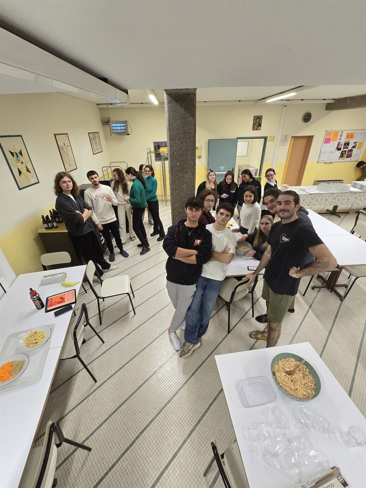

::: {.csf-hero .csf-hero--split}
::: {.csf-hero__body}

🍫 Padova · always free · since 2022

<h1 class="csf-hero__title">Bring one dish. Meet <em>fifteen neighbours</em>.</h1>

<strong>Cuochi senza fuochi is a free potluck dinner club in Padova.</strong> Once a month,
about fifteen people who mostly haven't met put one dish each in the middle of a table
and eat everything. You don't need a kitchen, you don't pay anything, and coming on
your own is the normal way to arrive.

::: {.csf-actions}
[Come to the next dinner](join.qmd){.csf-btn .csf-btn--primary}
[See how it works](how-it-works.qmd){.csf-btn .csf-btn--ghost}
:::

  ✅ Always free
  ✅ No cooking skill needed
  ✅ Come alone, that's the point
  ✅ English &amp; Italian

  Have a look first:
  <a class="csf-follow__link" href="https://www.instagram.com/cuochi_senza_fuochi/" aria-label="Cuochi senza fuochi on Instagram"><i class="bi bi-instagram"></i> Instagram</a>
  <a class="csf-follow__link" href="https://www.tiktok.com/@cuochi_senza_fuochi" aria-label="Cuochi senza fuochi on TikTok"><i class="bi bi-tiktok"></i> TikTok</a>
  <a class="csf-follow__link" href="https://www.youtube.com/@cuochisenzafuochi" aria-label="Cuochi senza fuochi on YouTube"><i class="bi bi-youtube"></i> YouTube</a>

:::

::: {.csf-hero__figure}
{.csf-hero__photo fig-alt="About eighteen people standing among tables of shared food in a borrowed common room in Padova"}

A real evening: a borrowed common room, trays carried across town, and eighteen people who met two hours earlier.

:::
:::

  <strong>1 dish</strong> is your whole contribution
  <strong>€0</strong> to attend, about €5 of ingredients
  <strong>~15 people</strong> around one table
  <strong>Monthly</strong> evenings, always in Padova

::: {.csf-section}

Start to finish

<h2 class="csf-section__title">What actually happens</h2>

Four steps, and nothing hidden between them. This is the entire format.

::: {.csf-steps}
- ### You say you're coming
  Send a message on Instagram, TikTok or YouTube. We reply with the address, the date
  and roughly how many people to expect.

- ### You bring one dish
  Something you can make without a real kitchen, for 4–6 people. Bought at the
  supermarket counts. Nobody is judging.

- ### Everyone eats everything
  Plates go in the middle of the table. You try fourteen things you've never had,
  and you talk to whoever is next to you.

- ### You go home with numbers
  Not a networking event. Just the neighbours you'll now bump into at the market.
:::
:::

::: {.csf-section}

Why it works

<h2 class="csf-section__title">Three things that make it different</h2>

::: {.csf-grid}
::: {.csf-card}
🔥

### Senza fuochi — without fires
The name is the promise. Student rooms don't have real kitchens, and that has never
stopped anyone. No-bake, no-oven, one-pan: everything on our table was made in a
shared kitchen or not cooked at all.
:::

::: {.csf-card}
💸

### Cheaper than one drink
A potluck costs each person the price of one dish. Meeting people in this city usually
means a bar tab or a club entry. This is the version you can afford every month.
:::

::: {.csf-card}
🧠

### Offline, on purpose
No app, no swiping, no feed. Fifteen people, one table, phones face down.
You remember conversations you had standing up with a plate in your hand.
:::
:::
:::

::: {.csf-quote}
When you arrive in a new city you look for an affordable place to sleep and a way to get to work.
With those two things, the capital is guaranteed. But what about **human capital**?

<cite>— the idea behind Cuochi senza fuochi, March 2022</cite>
:::

::: {.csf-section}

From the table

<h2 class="csf-section__title">Recent dinners</h2>

Photos and short write-ups from the last few evenings. This is what you're walking into.

::: {#latest-events}
:::

[See all events →](events.qmd)
:::

::: {.csf-section}

Follow along

<h2 class="csf-section__title">See a dinner before you come to one</h2>

Every table gets filmed and photographed. If you'd rather watch before you commit,
start here — and a DM on any of the three is a perfectly good way to sign up.

  <a class="csf-social__card csf-social__card--ig" href="https://www.instagram.com/cuochi_senza_fuochi/">
    <i class="bi bi-instagram"></i>
    Instagram
    &#64;cuochi_senza_fuochi
    Photos from every dinner, and the next date in stories.
    Follow →
  </a>
  <a class="csf-social__card csf-social__card--tt" href="https://www.tiktok.com/@cuochi_senza_fuochi">
    <i class="bi bi-tiktok"></i>
    TikTok
    &#64;cuochi_senza_fuochi
    Short clips of the table filling up — the fastest way to get the idea.
    Watch →
  </a>
  <a class="csf-social__card csf-social__card--yt" href="https://www.youtube.com/@cuochisenzafuochi">
    <i class="bi bi-youtube"></i>
    YouTube
    &#64;cuochisenzafuochi
    Longer cuts, plus recipes you can make with no oven at all.
    Subscribe →
  </a>

:::

::: {.csf-band}
## Next dinner: come and bring something

You don't need to know anyone. You don't need to cook. Most people at their first
Cuochi senza fuochi came on their own — that is the normal way to arrive.

::: {.csf-actions}
[Join the next dinner](join.qmd){.csf-btn .csf-btn--primary}
[Watch a 30-second clip](https://www.tiktok.com/@cuochi_senza_fuochi){.csf-btn .csf-btn--ghost}
:::
:::
