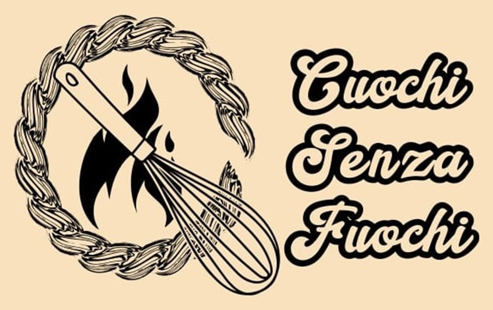

::: {.csf-hero}

🍫 Padova · free · no kitchen needed

<h1 class="csf-hero__title">Moving to a new city is easy. Making <em>friends</em> is the hard part.</h1>

Cuochi senza fuochi is a potluck club for people who just arrived in Padova for work or study.
You bring one thing to eat — anything, even a bar of chocolate — and you leave with a table
full of people who live near you.

::: {.csf-actions}
[Come to the next one](join.qmd){.csf-btn .csf-btn--primary}
[See how it works](how-it-works.qmd){.csf-btn .csf-btn--ghost}
:::

  ✅ Always free
  ✅ No cooking skill required
  ✅ Come alone, that's the point
  ✅ English &amp; Italian spoken

:::

<h2 class="csf-section__title">What actually happens</h2>

::: {.csf-steps}
- ### You say you're coming
  Send us a message. We tell you the address, the date and roughly how many people to expect.

- ### You bring one dish
  Something you can make without a real kitchen. Bought at the supermarket counts. Nobody is judging.

- ### Everyone eats everything
  Plates go in the middle of the table. You try fourteen things you've never had, and you talk.

- ### You go home with numbers
  Not a networking event. Just the neighbours you'll now bump into at the market.
:::

::: {.csf-section}
::: {.csf-grid}
::: {.csf-card}
🔥

### Senza fuochi — without fires
The name is the promise. Student rooms don't have real kitchens, and that has never stopped anyone.
No-bake, no-oven, one-pan: everything on our table was made in a shared kitchen or not cooked at all.
:::

::: {.csf-card}
💸

### Cheaper than one drink
A potluck costs each person the price of one dish. Meeting people in this city usually means
a bar tab or a club entry. This is the version you can afford every month.
:::

::: {.csf-card}
🧠

### Offline, on purpose
No app, no swiping, no feed. Fifteen people, one table, phones face down.
You remember conversations you had standing up with a plate in your hand.
:::
:::
:::

::: {.csf-quote}
When you arrive in a new city you look for an affordable place to sleep and a way to get to work.
With those two things, the capital is guaranteed. But what about **human capital**?

<cite>— the idea behind Cuochi senza fuochi, March 2022</cite>
:::

::: {.csf-section}

From the table

<h2 class="csf-section__title">Recent dinners</h2>

Photos and short write-ups from the last few evenings. This is what you're walking into.

::: {#latest-events}
:::

[See all events →](events.qmd)
:::

::: {.csf-band}
## Next dinner: come and bring something

You don't need to know anyone. You don't need to cook. Most people at their first
Cuochi senza fuochi came on their own — that is the normal way to arrive.

::: {.csf-actions}
[Join the next dinner](join.qmd){.csf-btn .csf-btn--primary}
[Watch a 30-second clip](https://www.youtube.com/@cuochisenzafuochi/shorts){.csf-btn .csf-btn--ghost}
:::
:::
